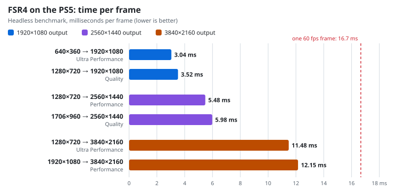
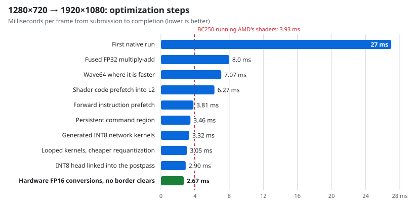
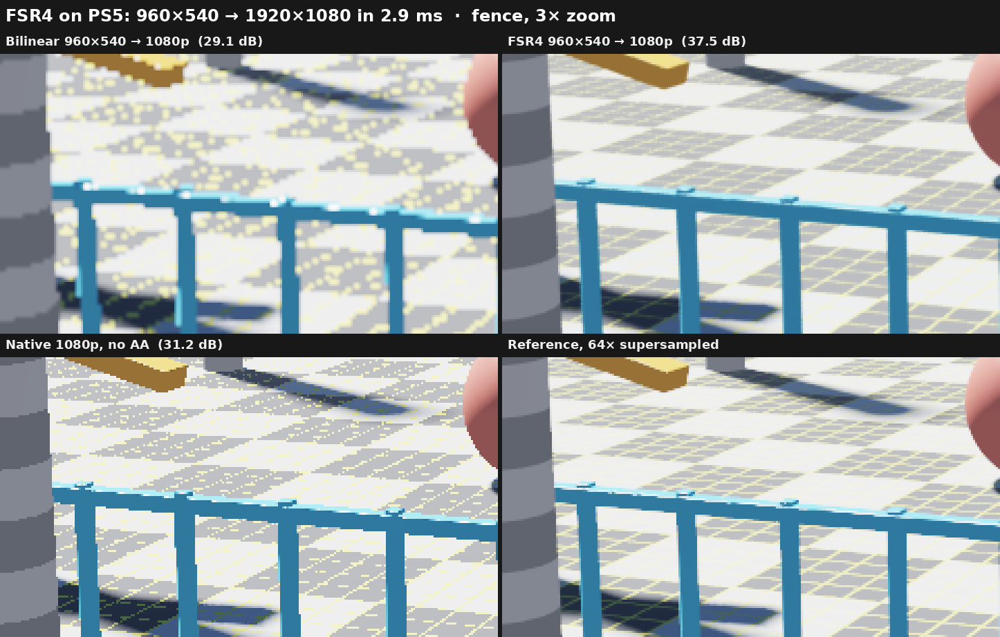
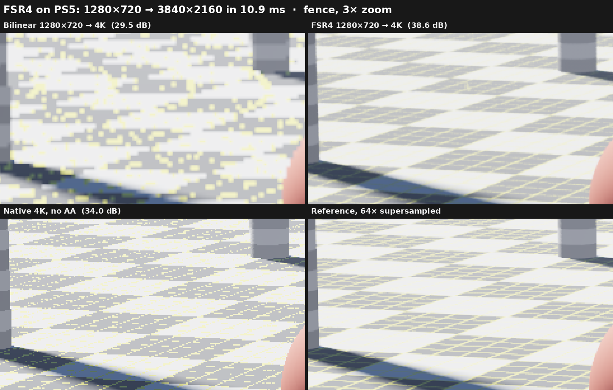

# PS5 FSR4

> [!WARNING]
> **Experimental.** FSR4 runs natively on the PS5 and passes its acceptance
> against the WARP reference in every captured scenario up to 2560×1440, but
> this is not a release. The SDK is built locally from the BC250 RC11 build of
> AMD's FSR4 provider, and it needs a diagnostic profile of the Vulkan driver.

> [!IMPORTANT]
> **Primary FSR4 porting credit: the BC250 FSR4 project.**
> Our FSR4 effort builds on the pioneering work of **[dmoraza (dmorazasanchez)](https://github.com/dmorazasanchez/bc250-fsr4)**
> and **[daniel-h-0 and contributors](https://github.com/daniel-h-0/bc250-fsr4-fork)**,
> whose BC250 fork is our primary technical reference for FSR4 INT8 shader
> optimizations, provider tooling and reference workloads.
> **AMD / GPUOpen created FSR4 itself.** BlackBearReloaded's contribution here is
> the native PS5 adaptation, integration and validation.
> See [full credits and source provenance](LICENSING.md#fsr4-and-bc250-credits).

A reusable **FSR 4.1.1 INT8 SDK for native PS5 homebrew**, running on Vulkan
compute. The Vulkan driver is the [`external/ps5-vulkan`](external/ps5-vulkan)
submodule: BlackBearReloaded's fork of
[Manuel Pereira's ps5-vulkan](https://github.com/mpereiraesaa/ps5-vulkan).
This project is independent of the upstream driver project.

**Status:** Experimental.

- The `ps5_fsr4` runtime upscales 1280×720 to 1920×1080 on the PS5 in about
  2.7 ms per frame, and outputs up to 3840×2160 ([performance](#performance)).
  Generated INT8 kernels run the network, including the postpass's learned
  head, faster than AMD's converted shaders and produce the same bytes.
- Every captured scenario up to 2560×1440 is accepted: static, motion, camera
  cut, SDR, dynamic resolution, sharpening, several output sizes, the 1080p
  and 1440p targets and AMD's Ultra Performance model for 3× upscaling. At
  4K, motion and Ultra Performance pass too; in the static capture one frame
  of four misses the rule by 0.16 dB
  ([validation](VALIDATION.md#fsr4-acceptance)).
- An interactive demo renders a scene, upscales it and presents it at 60 fps.
- `tools/build_fsr4_sdk.py` stages the SDK: `libps5_fsr4.a`, its header,
  notices and a warmed pipeline cache ([FSR4 SDK](docs/FSR4_SDK.md)).

## Performance

<picture>
  <source media="(prefers-color-scheme: dark)" srcset="docs/perf/cases-dark.svg">
  
</picture>

| Render → output | Mode | Time per frame | Share of a 60 fps frame |
| --- | --- | ---: | ---: |
| 640×360 → 1920×1080 | Ultra Performance | 3.04 ms | 18% |
| 1280×720 → 1920×1080 | Quality | 3.52 ms | 21% |
| 1280×720 → 2560×1440 | Performance | 5.48 ms | 33% |
| 1706×960 → 2560×1440 | Quality | 5.98 ms | 36% |
| 1280×720 → 3840×2160 | Ultra Performance | 11.48 ms | 69% |
| 1920×1080 → 3840×2160 | Performance | 12.15 ms | 73% |

These times come from the headless benchmark (`tools/build_fsr4_bench.py`).
It submits 1,800 frames back to back and times each from submission to
completion on the GPU. The interactive demo paces frames at 60 fps and
measures less: 2.67 ms for 1280×720 → 1920×1080. For that case AMD's
converted shaders alone take 3.26 ms on the PS5, and 3.93 ms of GPU time on a
BC250 at 1850 MHz.

<picture>
  <source media="(prefers-color-scheme: dark)" srcset="docs/perf/history-dark.svg">
  
</picture>

`tools/build_fsr4_perf_charts.py` draws both charts from the measurements
recorded in it.

## Before and after

*Captured on a PS5: FSR4 upscales 960×540 to 1920×1080 in about 2.7 ms. From a quarter of the
pixels it comes closer to a 64× supersampled reference (37.5 dB) than native 1080p rendering
does (31.2 dB).*

*At 4K: FSR4's Ultra Performance model upscales 1280×720, a ninth of the pixels, to
3840×2160 in 11.5 ms (headless benchmark). It comes closer to the reference (38.6 dB) than
native 4K rendering does (34.0 dB).*

> [!TIP]
> **Every comparison is in [`comparisons/`](comparisons/README.md)**: three shots of the demo
> scene at [1080p](comparisons/README.md) (from 1280×720 and 960×540),
> [1440p](comparisons/2560x1440/README.md) (from 1706×960 and 1280×720) and
> [4K](comparisons/3840x2160/README.md) (from 1920×1080 and 1280×720), with lossless full-size
> frames, 1:1 crops, 3× zooms, PSNR/SSIM against the supersampled reference and, at 1080p, an
> orbiting motion clip, all captured on the console.

## Layout

| Path | Contents |
| --- | --- |
| `include/ps5fsr4/` | Public C API |
| `src/` | Runtime: context, dispatch, constants and pass tables |
| `tools/` | Shader converter, reference exports, runtime/SDK/app builders, acceptance |
| `tests/` | Host tests |
| `examples/` | Runtime test, interactive demo, comparison capture and replay witnesses |
| `comparisons/` | Before/after captures of the demo scene at 1080p, 1440p and 4K, built by `tools/build_fsr4_comparisons.py` |
| `docs/` | SDK guide, reference procedure, research notes, performance charts |
| `external/ps5-vulkan/` | The Vulkan driver (submodule) |

Clone with `git clone --recurse-submodules`, or let `make` fetch the driver, then
follow [BUILDING.md](BUILDING.md).

## Development

- [Build instructions](BUILDING.md)
- [FSR4 SDK](docs/FSR4_SDK.md)
- [Validation](VALIDATION.md)
- [Implementation plan](docs/IMPLEMENTATION_PLAN.md)
- [Reference tools](docs/FSR4_REFERENCE_RUNTIME.md)
- [Vulkan driver API](external/ps5-vulkan/API.md)

Keep test captures, logs and detailed results local. Commit code changes with
brief descriptions. This repository remains public.

## License

Project code is GPL-3.0-or-later. See [LICENSE](LICENSE) and
[LICENSING.md](LICENSING.md) for credits and the driver and AMD terms.
