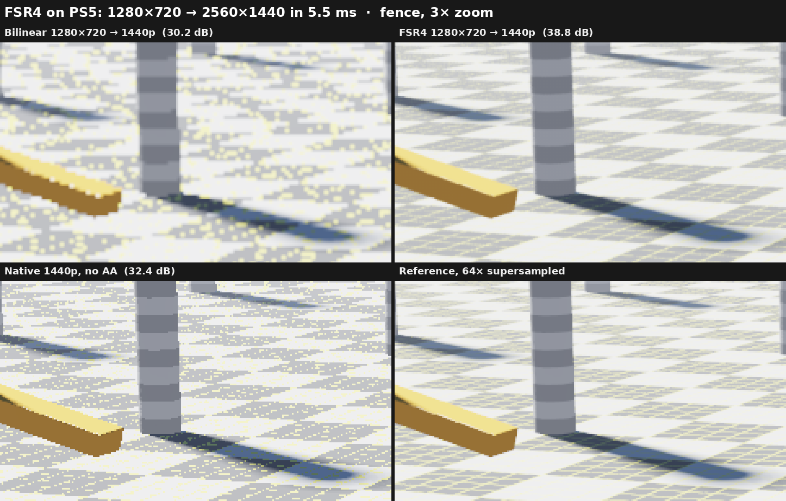
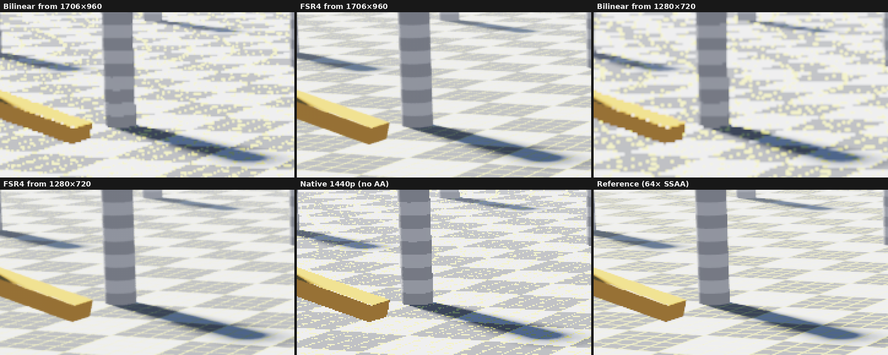
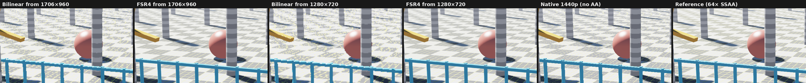
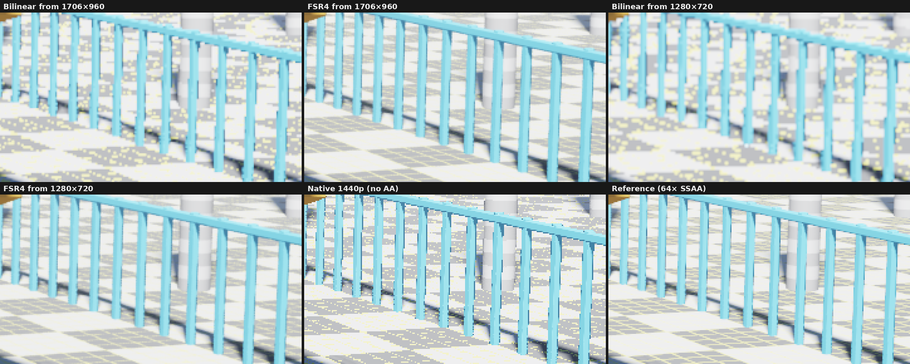
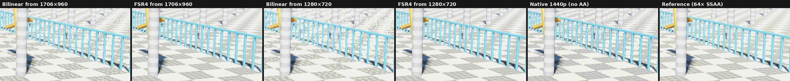
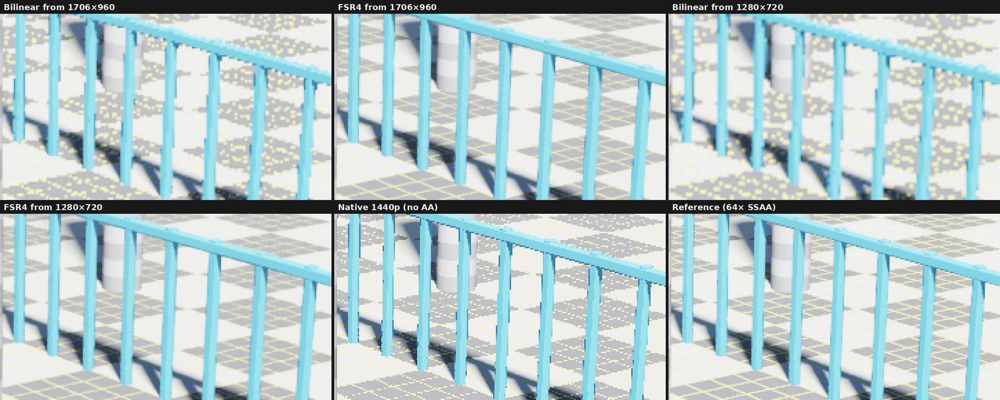
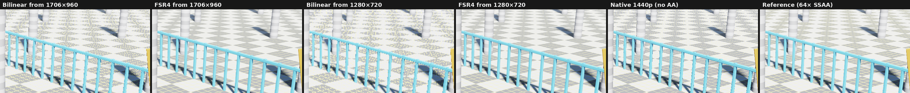

# FSR4 on PS5: before and after at 1440p

Other output sizes: [all comparisons](../README.md).

Frames of the demo scene (`examples/fsr4_demo_scene.comp`) captured on the console by `examples/fsr4_compare_main.c`: a bilinear upscale of the render, the FSR4 output after the static shot converged (48 jittered frames or a whole jitter cycle, whichever is longer), a native 1440p render without anti-aliasing and a 64-sample supersampled reference. All are tonemapped like the demo. Metrics are against the reference (SSIM on luma, 7×7 window).

> [!CAUTION]
> GitHub scales and compresses images shown inside a page. For the real pixels, open a file such as `overview/full/1280x720-fsr4.png` and use Raw or Download.

## fence

| Image | PSNR (dB) | SSIM |
| --- | ---: | ---: |
| Bilinear from 1706×960 | 31.76 | 0.9444 |
| FSR4 from 1706×960 | 36.98 | 0.9870 |
| Bilinear from 1280×720 | 30.19 | 0.9235 |
| FSR4 from 1280×720 | 38.79 | 0.9896 |
| Native 1440p (no AA) | 32.40 | 0.9577 |

Full frames: [fence/full/](fence/full/). Crops, zooms and windows: [fence/metrics.md](fence/metrics.md).

## horizon

| Image | PSNR (dB) | SSIM |
| --- | ---: | ---: |
| Bilinear from 1706×960 | 32.56 | 0.9374 |
| FSR4 from 1706×960 | 39.17 | 0.9874 |
| Bilinear from 1280×720 | 31.23 | 0.9150 |
| FSR4 from 1280×720 | 39.57 | 0.9886 |
| Native 1440p (no AA) | 32.72 | 0.9505 |

Full frames: [horizon/full/](horizon/full/). Crops, zooms and windows: [horizon/metrics.md](horizon/metrics.md).

## overview

| Image | PSNR (dB) | SSIM |
| --- | ---: | ---: |
| Bilinear from 1706×960 | 32.25 | 0.9352 |
| FSR4 from 1706×960 | 38.07 | 0.9855 |
| Bilinear from 1280×720 | 31.01 | 0.9114 |
| FSR4 from 1280×720 | 39.18 | 0.9883 |
| Native 1440p (no AA) | 32.43 | 0.9486 |

Full frames: [overview/full/](overview/full/). Crops, zooms and windows: [overview/metrics.md](overview/metrics.md).
