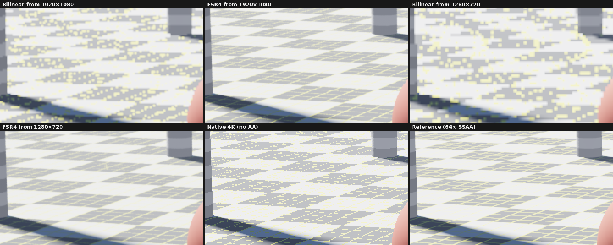
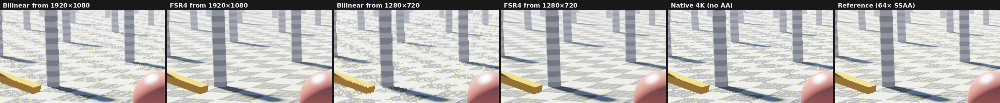
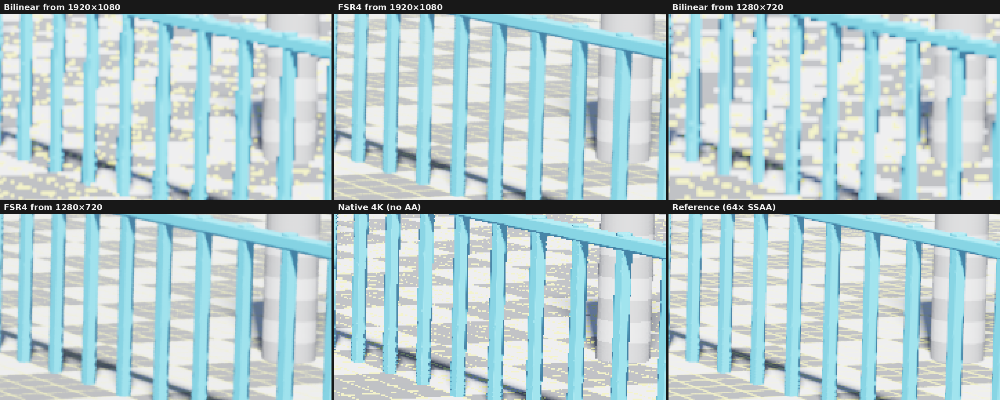
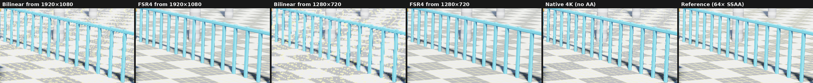
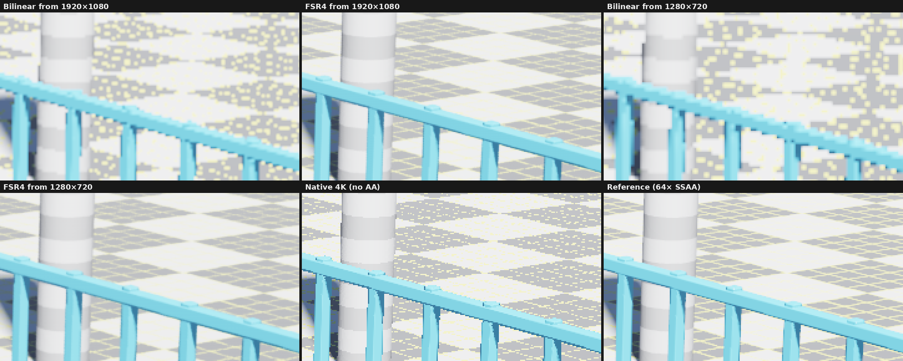
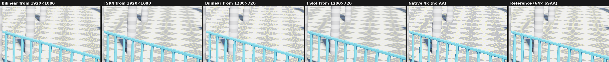

# FSR4 on PS5: before and after at 4K

Other output sizes: [all comparisons](../README.md).

Frames of the demo scene (`examples/fsr4_demo_scene.comp`) captured on the console by `examples/fsr4_compare_main.c`: a bilinear upscale of the render, the FSR4 output after the static shot converged (48 jittered frames or a whole jitter cycle, whichever is longer), a native 4K render without anti-aliasing and a 64-sample supersampled reference. All are tonemapped like the demo. Metrics are against the reference (SSIM on luma, 7×7 window).

> [!CAUTION]
> GitHub scales and compresses images shown inside a page. For the real pixels, open a file such as `overview/full/1280x720-fsr4.png` and use Raw or Download.

## fence

| Image | PSNR (dB) | SSIM |
| --- | ---: | ---: |
| Bilinear from 1920×1080 | 31.81 | 0.9402 |
| FSR4 from 1920×1080 | 40.41 | 0.9921 |
| Bilinear from 1280×720 | 29.55 | 0.9120 |
| FSR4 from 1280×720 | 38.60 | 0.9896 |
| Native 4K (no AA) | 33.99 | 0.9673 |

Full frames: [fence/full/](fence/full/). Crops, zooms and windows: [fence/metrics.md](fence/metrics.md).

## horizon

| Image | PSNR (dB) | SSIM |
| --- | ---: | ---: |
| Bilinear from 1920×1080 | 32.52 | 0.9335 |
| FSR4 from 1920×1080 | 41.01 | 0.9915 |
| Bilinear from 1280×720 | 30.42 | 0.9038 |
| FSR4 from 1280×720 | 39.06 | 0.9885 |
| Native 4K (no AA) | 34.21 | 0.9625 |

Full frames: [horizon/full/](horizon/full/). Crops, zooms and windows: [horizon/metrics.md](horizon/metrics.md).

## overview

| Image | PSNR (dB) | SSIM |
| --- | ---: | ---: |
| Bilinear from 1920×1080 | 32.34 | 0.9308 |
| FSR4 from 1920×1080 | 40.74 | 0.9914 |
| Bilinear from 1280×720 | 30.17 | 0.8972 |
| FSR4 from 1280×720 | 38.46 | 0.9878 |
| Native 4K (no AA) | 33.95 | 0.9609 |

Full frames: [overview/full/](overview/full/). Crops, zooms and windows: [overview/metrics.md](overview/metrics.md).
