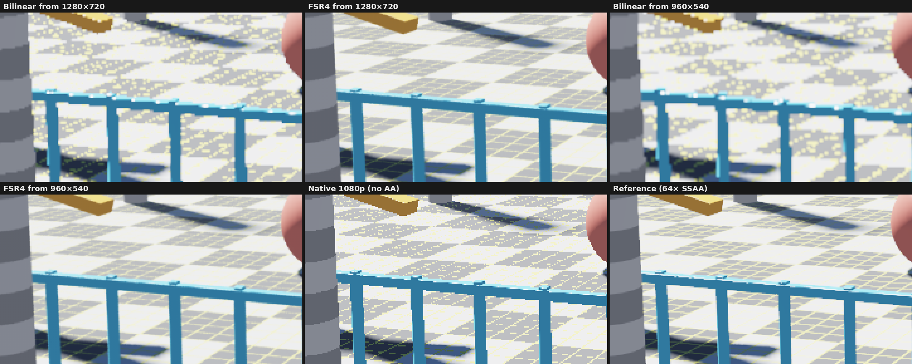
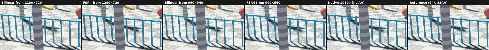
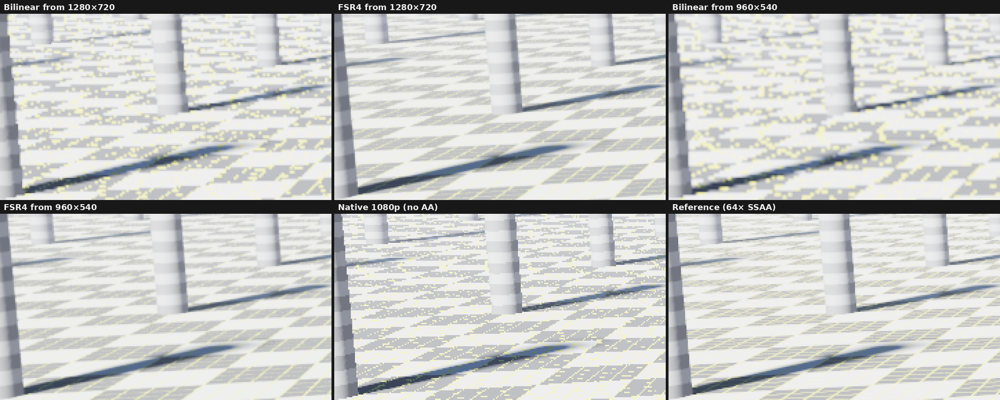
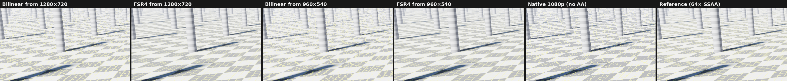
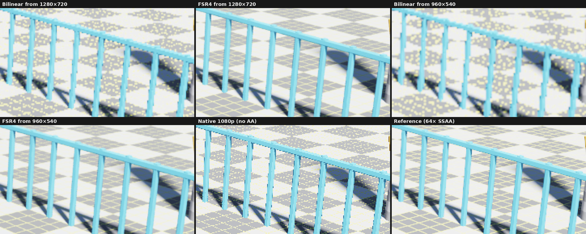
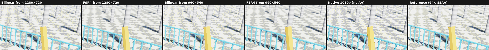
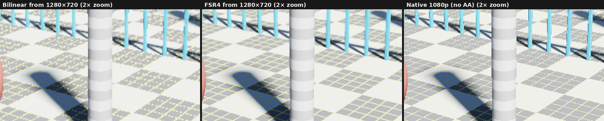

# FSR4 on PS5: before and after

Other output sizes: [1440p](2560x1440/README.md), [4K](3840x2160/README.md).

Frames of the demo scene (`examples/fsr4_demo_scene.comp`) captured on the console by `examples/fsr4_compare_main.c`: a bilinear upscale of the render, the FSR4 output after the static shot converged (48 jittered frames), a native 1080p render without anti-aliasing and a 64-sample supersampled reference. All are tonemapped like the demo. Metrics are against the reference (SSIM on luma, 7×7 window).

> [!CAUTION]
> GitHub scales and compresses images shown inside a page. For the real pixels, open a file such as `overview/full/960x540-fsr4.png` and use Raw or Download.

## fence

| Image | PSNR (dB) | SSIM |
| --- | ---: | ---: |
| Bilinear from 1280×720 | 30.98 | 0.9370 |
| FSR4 from 1280×720 | 37.80 | 0.9890 |
| Bilinear from 960×540 | 29.09 | 0.9095 |
| FSR4 from 960×540 | 37.55 | 0.9877 |
| Native 1080p (no AA) | 31.22 | 0.9496 |

Full frames: [fence/full/](fence/full/). Crops, zooms and windows: [fence/metrics.md](fence/metrics.md).

## horizon

| Image | PSNR (dB) | SSIM |
| --- | ---: | ---: |
| Bilinear from 1280×720 | 31.96 | 0.9284 |
| FSR4 from 1280×720 | 39.02 | 0.9879 |
| Bilinear from 960×540 | 30.35 | 0.8993 |
| FSR4 from 960×540 | 38.57 | 0.9862 |
| Native 1080p (no AA) | 31.69 | 0.9405 |

Full frames: [horizon/full/](horizon/full/). Crops, zooms and windows: [horizon/metrics.md](horizon/metrics.md).

## overview

| Image | PSNR (dB) | SSIM |
| --- | ---: | ---: |
| Bilinear from 1280×720 | 31.92 | 0.9280 |
| FSR4 from 1280×720 | 38.63 | 0.9876 |
| Bilinear from 960×540 | 30.10 | 0.8951 |
| FSR4 from 960×540 | 38.19 | 0.9859 |
| Native 1080p (no AA) | 31.37 | 0.9375 |

Full frames: [overview/full/](overview/full/). Crops, zooms and windows: [overview/metrics.md](overview/metrics.md).

## Motion

90 frames of an orbiting camera with the rotor spinning: [clip.mp4](clip/clip.mp4), [2× zoom](clip/clip_zoom.mp4).

