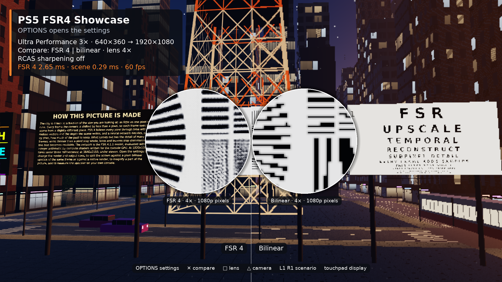

# PS5 FSR4 Showcase



A native PS5 app, packaged as its own title (**PPSA99011**, *PS5 FSR4 Showcase*),
that shows what the `ps5_fsr4` SDK does on the console. It draws a city at dusk
at a fraction of the output size, upscales it with FSR 4 and presents it at
60 fps. A settings menu changes the render and output sizes, compares FSR 4
with a bilinear upscale and with native rendering, and measures the upscaler on
the console it runs on.

## The scene

The city is built from what an upscaler finds hard, and nothing in it is
filtered: every render pixel is one sample, as in a game without anti-aliasing.

- **Thinner than a pixel:** tram wires 3 cm thick, strings of lights across the
  streets, antennas, lamp posts, a chain-link fence around each park and the
  leaves of its tree.
- **A lattice tower** 144 m tall, made of girders, braces and posts, and a
  **big wheel** with spokes, stays and lights.
- **Fine regular patterns:** louvred facades, brick with mortar lines, balcony
  bars, window mullions, pavement joints and zebra crossings.
- **Text and a resolution chart** on billboards in an open square: a reading
  chart whose rows get smaller, a page of small print, neon signs, and a chart
  with a star of 72 spokes and line pairs from 16 cm down to a millimetre.
- **Motion:** two tram lines, traffic with head and tail lights, the turning
  wheel and its gondolas, a blinking beacon. Each writes its own motion vectors.

`city.comp` casts one ray per pixel in a compute shader: across the street plan
cell by cell, and against the landmarks. It writes linear HDR color, depth and
motion vectors, which is all FSR 4 needs.

## Settings

OPTIONS opens the menu. The D-pad selects a row and changes its value.

| Row | Values |
| --- | --- |
| Scenario | The six render and output sizes of the [performance table](../../README.md#performance), or *Custom* |
| Output size | 1920×1080, 2560×1440, 3840×2160 |
| Quality mode | Native AA (1×), Quality (1.5×), Balanced (1.7×), Performance (2×), Ultra Performance (3×, AMD's dedicated model) |
| Compare | FSR 4; FSR 4 split against bilinear or against native rendering; bilinear; native |
| Lens | Off, or 2× to 8×: a magnifier on the output's own pixels, paired in a split view |
| RCAS sharpening | Off, or a strength of 0.1 to 1.0 |
| Dynamic resolution | The render size sweeps between the mode's size and half of it; history is kept |
| Camera | Cinematic (eight shots through the city) or free flight |
| Animation | Running or paused |
| On-screen display | Full, compact or off |
| Benchmark this setting | Times FSR 4 at the current sizes |
| Benchmark the six scenarios | Times all six and shows them beside the README's numbers |
| Guided tour | Twelve chapters, about two and a half minutes |

The display is 1920×1080. A larger output is box-filtered down to it, so the
whole frame is supersampled, and the lens shows the output's own pixels.
Changing the output size recreates the FSR4 context, which takes about 85 ms.
A native view at 3840×2160 renders the scene a second time at that size.

## Controls

| Input | Action |
| --- | --- |
| OPTIONS | Settings |
| Cross | Next comparison |
| Square | Lens on or off |
| Triangle | Cinematic camera or free flight |
| L1 / R1 | Previous or next scenario |
| Touchpad | On-screen display: full, compact, off |
| D-pad | Move the lens, or the divider of a split view |
| Left stick | Free flight: move |
| Right stick | Free flight: look |
| L2 / R2 | Free flight: down and up |

The app starts with the guided tour. Any button ends it, and it starts again
after a minute without input.

## Performance on PS5

The six scenarios, measured by the `--selftest` build on a PS5 with system
software 13. *Benchmark* is
what the app's own benchmark reports: the mean of 300 FSR 4 frames submitted
back to back, each timed from submission to completion on the GPU. *In the app*
is the same measurement at the 60 fps the app runs at.

| Render → output | Mode | Benchmark (ms) | In the app (ms) | Scene (ms) | Frame rate |
| --- | --- | ---: | ---: | ---: | ---: |
| 640×360 → 1920×1080 | Ultra Performance | 2.78 | 2.64 | 0.7 | 60 |
| 1280×720 → 1920×1080 | Quality | 2.84 | 2.67 | 1.0 | 60 |
| 1280×720 → 2560×1440 | Performance | 4.74 | 4.36 | 1.1 | 60 |
| 1706×960 → 2560×1440 | Quality | 4.83 | 4.42 | 5.1 | 60 |
| 1920×1080 → 3840×2160 | Performance | 10.60 | 9.75 | 1.4 | 60 |
| 1280×720 → 3840×2160 | Ultra Performance | 10.66 | 9.76 | 1.0 | 60 |

FSR 4's cost follows the output size: the network runs at output resolution.
The scene costs between 0.5 and 5 ms, depending on the shot and the render
size; the view over the roofs is the most expensive. Composing the display
frame adds 1.6 to 1.9 ms.

## System software

| System software | Result |
| --- | --- |
| 13.x | 60 fps in every scenario; the numbers above |
| 10.x | Runs at about 28 fps |

System software 10 completes a GPU submission only at the next display
refresh, whatever its size. The app notices this when it starts and sends the
whole frame as one submission there, which leaves two refreshes per frame: one
for the frame's work and one for the flip. The times of the frame's parts are
then not known, so the on-screen display says so instead of showing them, and
the benchmark only measures that wait. Other versions have not been tried.

If the GPU fails, the app writes the failing stage to its log and returns to
the home screen.

## Download

Every [pre-release](https://github.com/blackbearreloaded/ps5-fsr4/releases)
from 01.000.000 on has `ps5-fsr4-showcase-VERSION-PPSA99011.zip`, built by GitHub
Actions. Extract it, upload the `PPSA99011` folder to `/data/homebrew/` on a
PS5 running a homebrew loader with ShadowMountPlus, and start **PS5 FSR4
Showcase** from the home screen once it is registered. Release 0.1.0 carried
an earlier showcase under the title PPSA99010; the two install side by side.

## Build and install

Stage the SDK first (`make sdk`, see [BUILDING.md](../../BUILDING.md)), then:

```sh
make showcase
```

This builds `build/fsr4-showcase/PPSA99011` with the SDK's warmed pipeline
cache. Upload the `PPSA99011` folder to `/data/homebrew/` and launch it from the
home screen once it is registered. The app runs until it is closed. It writes
`fsr4-showcase-log.txt` to `/data/fsr4-results` (or to its own `results`
folder) with `FSR4_SHOWCASE_*` lines: setup, chapters, benchmark results and
averaged timings every 120 frames.

`SHOWCASE_ARGS` passes options to `tools/build_fsr4_showcase.py`:

- `--release VERSION` also writes `ps5-fsr4-showcase-VERSION-PPSA99011.zip`,
  the package with a README, `notices/` and `SHA256SUMS`, and its SHA-256.
  Releases are numbered like PlayStation content versions (`01.000.000`), and
  the package carries that number as its content version.
  The app embeds FSR4 material under AMD's MIT terms, whose notice must stay
  with every copy ([THIRD_PARTY_NOTICES.md](../../THIRD_PARTY_NOTICES.md#amd-fsr4-material)).
  `make release VERSION=...` packages the whole release
  ([docs/RELEASING.md](../../docs/RELEASING.md)).
- `--selftest` replaces the controller with a scripted walk: the six scenarios,
  the comparisons, the menu and the benchmark. It logs one
  `FSR4_SHOWCASE_STEP` line with averaged timings and saves one 1920×1080 BGRA
  frame per step (`fsr4-showcase-NAME.bgra`, next to the log), then ends with
  `FSR4_SHOWCASE_SELFTEST_DONE` and closes the title.
- `--diagnose` builds an app for a console where the showcase does not start:
  it runs each GPU stage on its own, logs the system software version, each
  stage and the Vulkan driver's own messages (`fsr4-showcase-driver-log.txt`,
  next to the log), and closes itself.
- `--host` builds `build/fsr4-showcase-host/fsr4_showcase` instead: the same
  app for desktop Vulkan, without a display or a controller.

## Host preview

The host build runs the scripted walk off-screen and saves its frames, which is
how the scene and the menu were made. It needs the generated runtime tables
(`make runtime`) and a Vulkan driver; Mesa's lavapipe upscales a 1080p frame
in a quarter of a second.

```sh
make showcase SHOWCASE_ARGS=--host
cd build/fsr4-showcase-host
SHOWCASE_STEPS=1,6 SHOWCASE_STEP_FRAMES=24 ./fsr4_showcase   # frames/fsr4-showcase-NAME.bgra
SHOWCASE_KEYS=oddrx ./fsr4_showcase                           # button presses instead of the walk
```

`SHOWCASE_STEPS` picks steps of the walk by number and `SHOWCASE_STEP_FRAMES`
sets how long each runs. `SHOWCASE_KEYS` plays one button every four frames
(`o` OPTIONS, `u d l r` the D-pad, `x` Cross, `c` Circle, `s` Square,
`t` Triangle, `1` L1, `2` R1, `p` Touchpad, `.` nothing) and saves the last
frame as `fsr4-showcase-keys.bgra`.

## Launch assets

`sce_sys/` holds the icon, the two backgrounds and the selection music. The
icon and the backgrounds are artwork made for the app: `pic0.dds` is the home
screen background and `pic1.dds` the picture shown while the app starts.
`tools/build_fsr4_showcase_assets.py` encodes a 3840×2160 picture as BC7 for
either background and synthesizes the music, which
[ps5-at9-converter](https://github.com/blackbearreloaded/ps5-at9-converter)
encodes.

| File | Format |
| --- | --- |
| `icon0.png` | 512×512 PNG |
| `pic0.dds`, `pic1.dds` | 3840×2160 BC7 DDS (DX10 header) |
| `snd0.at9` | ATRAC9, 48 kHz stereo |

The HUD and the signs use DejaVu Sans, rasterized at build time from the system
font (`fonts-dejavu-core`) under the Bitstream Vera license.
